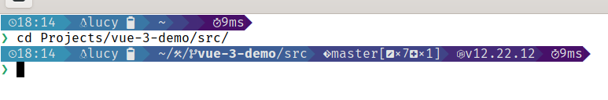

# Starship configuration

A [starship](https://starship.rs) configuration looking like that:


Example of other configuration: https://gist.github.com/ryo-ARAKI/48a11585299f9032fa4bda60c9bba593

Find icons in Nerd font: https://www.nerdfonts.com/cheat-sheet

## Usage

### Install a Nerd Font

[Download a font](https://www.nerdfonts.com/font-downloads) like FiraCode Nerd Font and unzip it.

- 🪟: select the fonts → right click → install
- 🐧: move the fonts folder to `/usr/share/fonts/truetype/` then change the ownership to `root` (`sudo chown -R root:root /usr/share/fonts/truetype/FiraCode`)

Then configure your terminal software to use the font.
For instance in GNOME Terminal, 𝍢 → Preferences → <your profile> → Text → Custom font

### Install Starship

See https://starship.rs/guide/#%F0%9F%9A%80-installation.

### Use this configuration file

```
git clone https://github.com/ldesgrange/starship-config
ln -s /path/to/starship-config/starship.toml ~/.config/starship.toml
```
